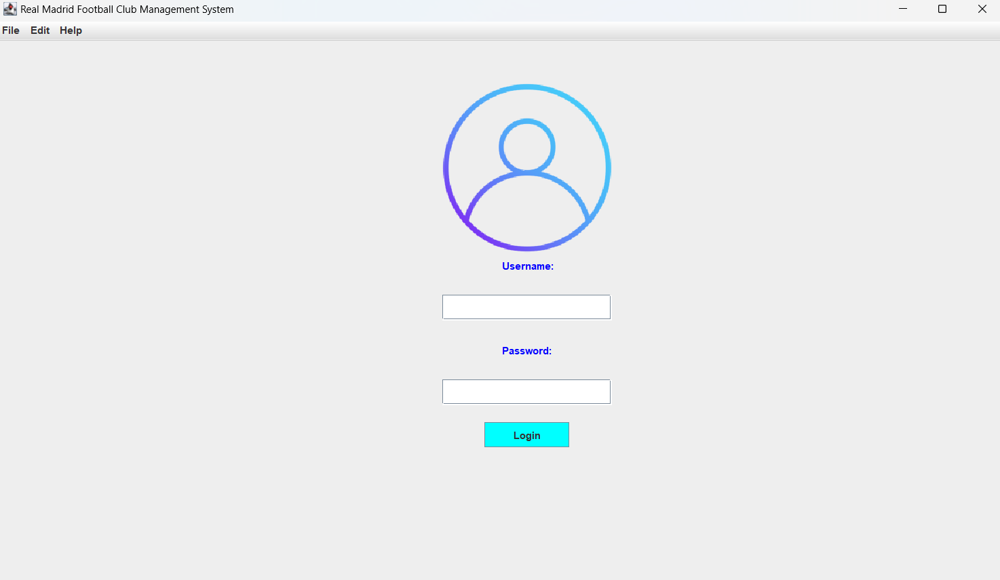
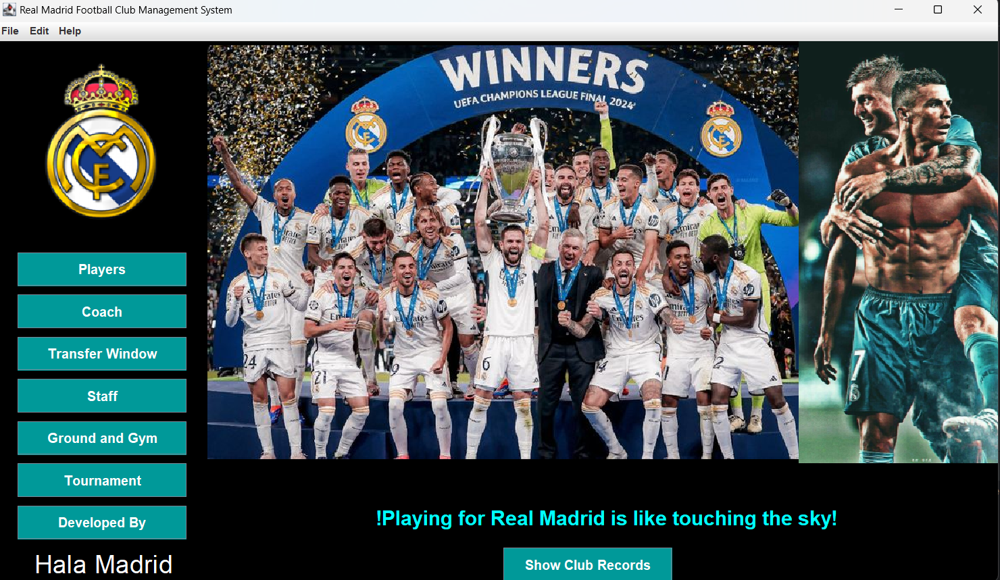

# Real Madrid Football Club Management System

A simple Java Swing-based desktop application for managing Real Madrid Football Club's details like players, coaches, staff, and tournaments. The application features a login system, a dashboard with multiple panels, and a functional menu bar.

## Features

- **Login System**: Users can log in with a username and password.
- **Dashboard**: Once logged in, users are taken to the main dashboard with navigation options.
- **Menu Bar**: File, Edit, and Help menus are provided for basic functionality.
- **Responsive Design**: Uses a combination of Java Swing components like `JFrame`, `JPanel`, `JMenuBar`, `JButton`, and `JLabel` to build the interface.
- **Images**: The application includes logos, player images, and backgrounds to enhance user experience.

## Project Structure

The project consists of the following key classes:

### `FootballClubManagementSystem`
This class contains the `main` method and is the entry point of the application. It initializes the login interface.

### `LoginUI`
This class sets up the login interface using Swing components like `JTextField`, `JPasswordField`, and `JButton`. Upon successful login, the user is taken to the dashboard.

### `MenuBarSetup`
This class sets up the `JMenuBar` for the application, adding basic menu items such as "File" (with an "Exit" option), "Edit", and "Help" (with an "About" option).

### `DashboardUI`
This class sets up the dashboard with two main sections:
- **Left Panel**: Contains a menu with buttons like "Players", "Coach", "Transfer Window", and others.
- **Right Panel**: Displays images of famous players, a slogan, and a button to view club records.

## Screenshots

### Login Screen

### Dashboard

## Setup and Usage

1. Create a new Java project in your preferred IDE (e.g., IntelliJ IDEA, Eclipse).
2. In the `src` folder of your Java project, create the following classes:
   - `FootballClubManagementSystem.java`
   - `LoginUI.java`
   - `MenuBarSetup.java`
   - `DashboardUI.java`
3. Copy and paste the provided code for each class into the respective Java files in the `src` folder.
4. Ensure that all image paths are correctly set in your code. Update the paths to point to the images on your local machine.
5. Run the project from your IDE.

Alternatively, you can run the project using the terminal:
- Navigate to the project directory.
- Compile the project files.
- Run the application.

## Login Credentials

- **Username**: `admin`
- **Password**: `admin123`

These credentials are hardcoded for demonstration purposes.

## Dependencies

- Java SE Development Kit (JDK) 8 or higher.
- Java Swing for GUI components.

## Contributing

Feel free to contribute to this project by submitting pull requests or opening issues.

1. Fork the repository.
2. Create your feature branch (`git checkout -b feature/new-feature`).
3. Commit your changes (`git commit -m 'Add some feature'`).
4. Push to the branch (`git push origin feature/new-feature`).
5. Open a Pull Request.

## License

This project is licensed under the MIT License - see the LICENSE file for details.

## Acknowledgements

- Real Madrid Football Club for the inspiration.
- Java Swing for providing the tools to build this application.
